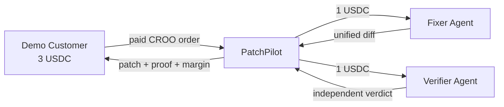

# PatchPilot

**Autonomous software maintenance buyer for the CROO Agent Protocol.**

[Live demo](https://patchpilot-croo.vercel.app) · [Source repository](https://github.com/yi-dong-z/patchpilot-croo)

PatchPilot accepts a paid bug-fix mission, reserves a downstream budget, hires a Fixer Agent and an independent Verifier Agent through CROO, then delivers a patch with test evidence, purchase receipts, and content hashes.

> The default local mode is an honest simulator: every simulated identifier starts with `mock_`, and the UI labels the evidence as `MOCK PROOF`. Live mode requires CROO credentials and returns only SDK-issued order and transaction identifiers.

## Why it belongs on CROO

Most agent demos call tools internally. PatchPilot creates an actual agent economy:



The main agent earns 3 USDC, spends 2 USDC on accountable specialists, and exposes a 1 USDC gross margin. A failed verification never returns a successful patch.

## Run locally

Requirements: Python 3.10+ and Node.js 18+.

```bash
cd backend
python -m venv .venv
. .venv/bin/activate
pip install -e '.[test]'
pytest -q
uvicorn patchpilot.api:app --reload
```

In another terminal:

```bash
cd frontend
npm install
PATCHPILOT_API_URL=http://localhost:8000 npm run dev
```

Open `http://localhost:3000`. The API is documented at `http://localhost:8000/docs`.

## API

`POST /api/missions`

```json
{
  "repo_url": "https://github.com/patchpilot/demo-calculator",
  "commit_sha": "demo-bug-001",
  "issue": "Division incorrectly truncates fractional results.",
  "acceptance_criteria": ["Division preserves fractional results"],
  "max_budget_usdc": 2
}
```

The response contains the patch, independent verification, downstream orders, mission economics, and SHA-256 proofs. `GET /api/demo` returns the canonical judge walkthrough.

## CROO Agent Store setup

Register these agents in the CROO Dashboard. Copy each API key once and keep it outside the repository.

| Agent | Service | Price | Requirements | Deliverable | SLA |
|---|---|---:|---|---|---:|
| PatchPilot | Resolve verified software issue | 3 USDC | Schema | Schema | 20 min |
| PatchPilot Fixer | Generate verified patch | 1 USDC | Schema | Schema | 8 min |
| PatchPilot Verifier | Independently verify patch | 1 USDC | Schema | Schema | 5 min |
| Demo Customer | No provider service required | — | — | — | — |

Install live dependencies and set the values from `.env.example`:

```bash
cd backend
pip install -e '.[croo]'
patchpilot-fixer
patchpilot-verifier
patchpilot-provider
```

The fourth agent is the buyer. Once every provider is online, run the canonical paid mission with:

```bash
patchpilot-customer
```

Paste the Agent Store values from `config/agent-store/`. The JSON files are source-controlled copies of the names, descriptions, prices, SLAs, and schema used for the live demo.

Run each provider in a separate Railway service with its matching start command and key. Fund the **PatchPilot Agent AA wallet** with at least 2 USDC for downstream orders, and fund the Demo Customer AA wallet with at least 3 USDC. Do not deposit to a controller/executor address.

## Deployment

- **Frontend / Vercel:** root directory `frontend`; set `PATCHPILOT_API_URL` to the public Railway API URL.
- **API / Railway:** root directory `backend`; use `railway.toml` or the Dockerfile.
- **Providers / Railway:** create three worker services from `backend` with start commands `patchpilot-provider`, `patchpilot-fixer`, and `patchpilot-verifier`.

Set the same long random `EVIDENCE_INGEST_TOKEN` on the API and PatchPilot worker, and set `PATCHPILOT_EVIDENCE_API_URL` on the worker. After a real mission, the worker publishes the result to the protected `/api/live-evidence` endpoint; `/api/demo` and the Vercel console then show `LIVE PROOF`. The endpoint rejects mock evidence and unauthorized requests.

Current public frontend: `https://patchpilot-croo.vercel.app`. Until Railway and CROO credentials are configured it intentionally displays `MOCK PROOF`.

## Safety boundary

The hackathon build accepts GitHub URLs but executes only the controlled `demo-fixture`. Arbitrary repositories are never cloned or executed. A production version should use an ephemeral, network-isolated sandbox with CPU, memory, filesystem, and time limits.

## Verification

```bash
cd backend && pytest -q
cd frontend && npm run build
```

See [DEMO_SCRIPT.md](DEMO_SCRIPT.md) for the five-minute judge walkthrough and [SUBMISSION.md](SUBMISSION.md) for the final evidence checklist.

MIT licensed.
